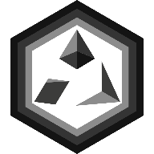

<h1 align="center">
  
  Crypto Clash
</h1>

> A decentralized Rock-Paper-Scissors game built on the BDL Test Network with commit-reveal mechanics for provably fair gameplay.

[](https://averel10.github.io/crypto_clash/)
[](https://docs.soliditylang.org/)
[](https://nextjs.org/)
[](https://www.typescriptlang.org/)

## About

Crypto Clash is a fully decentralized DApp that brings the classic Rock-Paper-Scissors game to the blockchain. Using a commit-reveal scheme, players can compete in a trustless environment where cheating is cryptographically impossible.

### Key Features

- **Commit-Reveal Mechanism** - Ensures fair play with cryptographic commitments
- **Fully On-Chain** - All game logic runs on Ethereum smart contracts
- **ETH Betting** - Stake ETH on your games
- **Modern UI** - Clean, responsive interface built with Next.js
- **Automated Deployment** - CI/CD pipeline with GitHub Actions

## Live Demo

**URL:** [https://averel10.github.io/crypto_clash/](https://averel10.github.io/crypto_clash/)

> **Note:** The live environment uses a reverse proxy setup to interact with the RPC endpoint at `https://rpc.hasrv.averel10.app/`. This is required because the production site uses HTTPS and cannot connect to HTTP RPC endpoints. The proxy is hosted on a private NAS and may be unavailable overnight.

## Documentation

For the complete functional specification, see:
**[REQUIREMENTS.md](./REQUIREMENTS.md)**

## Local Development

### Prerequisites

- Node.js (v18+)
- npm or yarn
- MetaMask or compatible Web3 wallet

### Environment Setup

Create a `.env` file in the `crypto_clash_contract` directory:

```env
API_URL="http://185.48.228.49:8545"
WALLET_PRIVATE_KEY=your_private_key_here
```

> **! Security Note:** Never commit your private key. The wallet specified here will be used to deploy contracts.

## Smart Contract Deployment

Navigate to the contract directory and run:

```bash
cd crypto_clash_contract

# Compile Solidity contracts
npm run compile

# Deploy to network
npm run deploy
```

**Output:** Contract ABIs and addresses are written to `config.json` in the root directory.

## Running the Frontend

From the `crypto_clash_frontend` directory:

```bash
cd crypto_clash_frontend

# Start development server
npm run dev
```

The application will be available at: **<http://localhost:3000/crypto_clash>**

> **Note:** The app runs on the `/crypto_clash` subpath. Ensure all routes and assets use this prefix. The `config.json` is automatically copied to the public assets directory on startup.

## CI/CD Pipeline

The project uses GitHub Actions for automated deployment:

- **Triggers:** All actions run on push to `main` branch
- **Contract Changes:** Automatically recompiles and redeploys contracts, commits updated `config.json`
- **Frontend Deployment:** Builds and deploys to GitHub Pages on any changes

## Project Structure

```plaintext
crypto_clash/
├── crypto_clash_contract/    # Solidity smart contracts
│   ├── contracts/            # Contract source files
│   ├── scripts/              # Deployment scripts
│   └── artifacts/            # Compiled contracts
├── crypto_clash_frontend/    # Next.js frontend
│   ├── app/                  # App routes and pages
│   └── public/               # Static assets
└── docs/                     # Additional documentation
```

Built with ❤️ for the decentralized web
