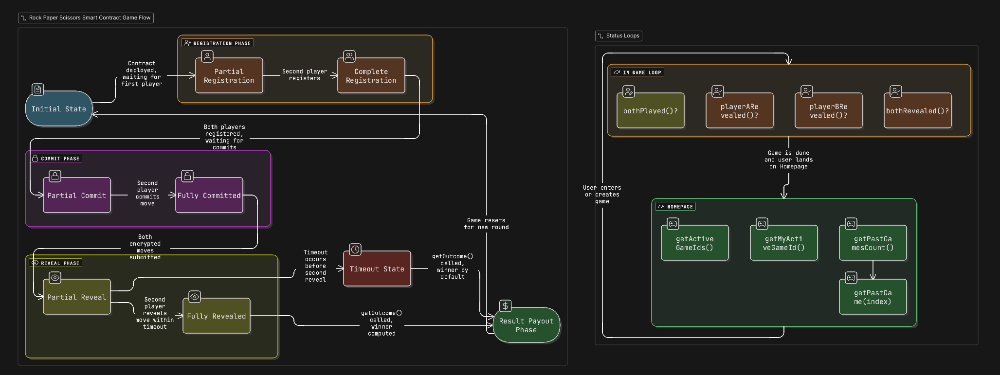

# Multi-Game Implementation Summary



## Overview

The Game smart contract has been updated to support multiple concurrent games. Each player can participate in only one active game at a time, and games are identified by unique game IDs and tracked by player addresses.

## Key Changes

### 1. Data Structure Updates

**Previous Structure:**

- Single `currentGame` variable

**New Structure:**

See [Data Structure Diagram](data-structure-diagram.md) for visual representation.

```solidity
// Mapping from player address to their active game ID
mapping(address => uint) private playerToActiveGame;

// Mapping from game ID to game state
mapping(uint => GameState) private games;

// Array to track all game IDs (for enumeration)
uint[] private gameIds;

// Counter for generating unique game IDs
uint private nextGameId = 1;

// Array to store completed games
GameState[] private pastGames;
```

**GameState struct updated with:**

- `uint gameId` - Unique identifier for each game
- `bool isActive` - Flag to track if game is currently active

### 2. Registration System

**New `register(uint gameId)` function:**

- If `gameId = 0`: Automatically finds an open game or creates a new one
- If `gameId > 0`: Joins the specified game (if valid and has space)
- Returns both player ID (1 or 2) and the game ID
- Enforces one active game per address

**Helper functions:**

- `findOrCreateGame()` - Finds a game with one player or creates new game
- `createNewGame()` - Creates a new game with unique ID

### 3. Game Flow Updates

All game functions now work with the player's active game:

- **`play(bytes32 encrMove)`** - Commits move to player's active game
- **`reveal(string memory clearMove)`** - Reveals move in player's active game
- **`getOutcome()`** - Calculates outcome for player's active game

### 4. Game Lifecycle

**Active Games:**

- Players are automatically assigned to their active game via `playerToActiveGame` mapping
- All modifiers check the player's active game ID

**Game Completion:**

- When `getOutcome()` is called:
  1. Game outcome is calculated
  2. Game is moved to `pastGames` array
  3. `resetGame()` clears player mappings and marks game as inactive
  4. Winners are paid
  5. Players are free to join new games

### 5. New Helper Functions

**Game Management:**

- `getMyActiveGameId()` - Returns caller's active game ID
- `getGameDetails(uint gameId)` - View any game's details
- `getActiveGameIds()` - Returns array of all active game IDs
- `getPastGamesCount()` - Returns number of completed games
- `getPastGame(uint index)` - Returns details of a past game

**Updated Helper Functions:**
All existing helper functions now operate on the caller's active game:

- `whoAmI()` - Returns player ID in their active game
- `bothPlayed()` - Checks if both players committed in caller's game
- `bothRevealed()` - Checks if both players revealed in caller's game
- `playerARevealed()` - Check player A status in caller's game
- `playerBRevealed()` - Check player B status in caller's game
- `revealTimeLeft()` - Time remaining in caller's game
- `getLastWinner()` - Outcome of caller's game

## Usage Examples

### Example 1: Auto-join or create game

```solidity
// Player registers with gameId = 0 to auto-find/create game
(uint playerId, uint gameId) = game.register{value: 0.01 ether}(0);
// Returns: (1, 1) if creating new game, or (2, X) if joining existing game
```

### Example 2: Join specific game

```solidity
// Player joins game ID 5
(uint playerId, uint gameId) = game.register{value: 0.01 ether}(5);
// Returns: (2, 5) if successful
```

### Example 3: Query active games

```solidity
// Get all active game IDs
uint[] memory activeGames = game.getActiveGameIds();

// Check details of a specific game
(address playerA, address playerB, uint bet, Outcomes outcome, bool isActive)
    = game.getGameDetails(gameId);
```

### Example 4: View game history

```solidity
// Get number of completed games
uint totalPastGames = game.getPastGamesCount();

// Get details of a specific past game
(address playerA, address playerB, uint bet, Outcomes outcome)
    = game.getPastGame(0);
```

## Benefits

1. **Concurrent Games**: Multiple games can run simultaneously
2. **Player Isolation**: Each player can only be in one game at a time
3. **Game Tracking**: All games are tracked with unique IDs
4. **History**: Completed games are preserved in `pastGames`
5. **Flexibility**: Players can auto-join available games or specify game IDs
6. **Backwards Compatible**: Existing game flow (commit-reveal-outcome) unchanged

## Security Considerations

1. **Reentrancy Protection**: Payment happens after game state is reset
2. **One Game Per Address**: Enforced via `notAlreadyInGame` modifier
3. **Game Isolation**: Players can only interact with their active game
4. **State Consistency**: Game marked inactive before clearing mappings

## Migration Notes

**Breaking Changes:**

- `register()` now returns `(uint playerId, uint gameId)` instead of just `uint playerId`
- `register()` now requires a `uint gameId` parameter (use 0 for auto-join)

**Non-Breaking:**

- All other function signatures remain the same
- Existing game flow unchanged
